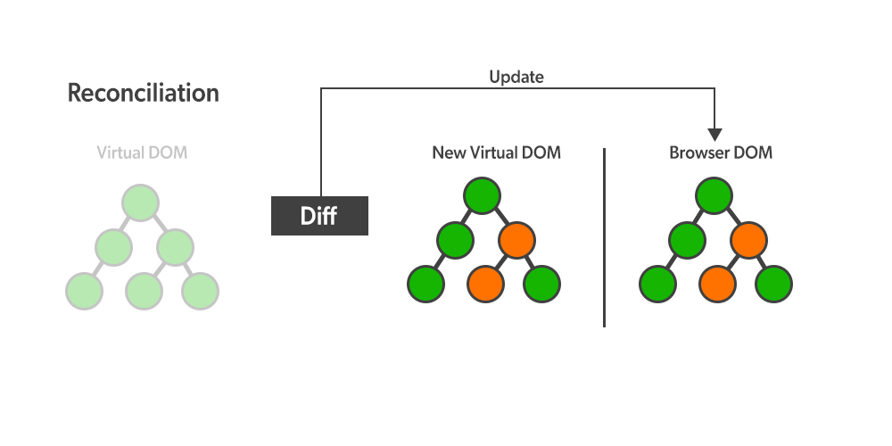

# Session 1 Giới thiệu React

Trong session này chúng ta sẽ lần lượt nắm các vấn đề sau:
> 🔸 React là gì ?
>
> 🔸React có phổ biến không ?
>
> 🔸Thị trường việc làm React
>
> 🔸React có thể làm được gì ?
>
> 🔸Tại sao nên học React
>
> 🔸Virtual DOM trong React là gì
> 
> 🔸Review lại Javascript Basic
>
> 🔸Tìm hiểu TypeScrip cơ bản
>

***

## 🔶  React là gì ?

- React là một thư viện JavaScript được hậu thuẩn bởi Facebook (by Jordan Walke)
- React là một thư viện giao diện người dùng (UI)
- React là một công cụ xây dựng các UI components

React lần đầu tiên được triển khai cho ứng dụng Newsfeed của Facebook năm 2011, sau đó được triển khai cho Instagram.com năm 2012. Nó được mở mã nguồn (open-sourced) tại JSConf US tháng 5 năm 2013.

***

## 🔶 React có phổ biến không ?

- Github Star: <https://github.com/facebook/react/>
- Google trend: <https://trends.google.com/trends/explore?q=%2Fm%2F012l1vxv,%2Fg%2F11c0vmgx5d,%2Fg%2F11c6w0ddw9>

- `Example Case`: Facebook, Instagram, Netflix, Reddit, Uber, Airbnb, The New York Times, Khan, Academy, Codecademy, SoundCloud, Discord, WhatsApp Web

***

## 🔶 React có thể làm được gì ?

- làm WEB APP
- làm Mobile APP
- làm Desktop APP

***

## 🔶  Tại sao nên học React

- Trend
- Cộng đồng lớn
- Thân thiện SEO (Shopee, chotot.com, Tiki, Lazada)
- Khả năng mở rộng và tái sử dụng cao
- Hiệu suất ứng dụng cao
- Phát triển nhanh (thư viện hỗ trợ khổng lồ)
- Khả năng tương thíc ngược
- Cơ hội việc làm cao

6 điểm nổi bật React mang lại

Nhiều ông lớn sử dụng

---

## 🔶 DOM ảo (Virtual DOM) là gì?

- DOM là viết tắt của Document Object Model. DOM đại diện cho một tài liệu HTML có cấu trúc cây logic. Mỗi nhánh của cây kết thúc bằng một nút và mỗi nút chứa các đối tượng.

- React giữ một bản “đại diện” nhưng nhẹ hơn của DOM “thực” trong bộ nhớ, gọi là DOM ảo (Virtual DOM). Khi trạng thái của một đối tượng (object) thay đổi, DOM ảo chỉ thay đổi đối tượng đó trong DOM thực, thay vì cập nhật tất cả các đối tượng.

Bạn có thể tưởng tượng, ở DOM có thẻ div và các thẻ p ở trong, React sử dụng Virtual DOM bằng cách tạo ra các object React.div và React.p và khi tương tác, ta sẽ tương tác qua các object đó một cách nhanh chóng mà không phải đụng tới DOM hay DOM API của nó.

Virtual DOM được tạo mới sau mỗi lần render lại.

---

## 🔶 Review lại Flexbox Css

[Mở Flexbox](Review-Flexbox/flexbox.md)

---

## 🔶 Javascript-ESNext

---

[Mở Javascript-ESNext](Javascript-ESNext.md)

## 🔶 Type Script Basic

Doc: <https://www.w3schools.com/typescript/>