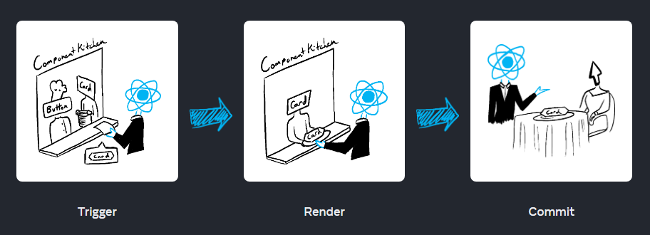
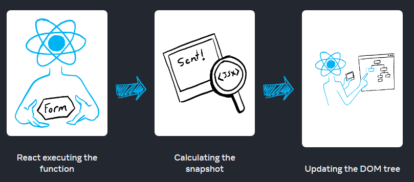
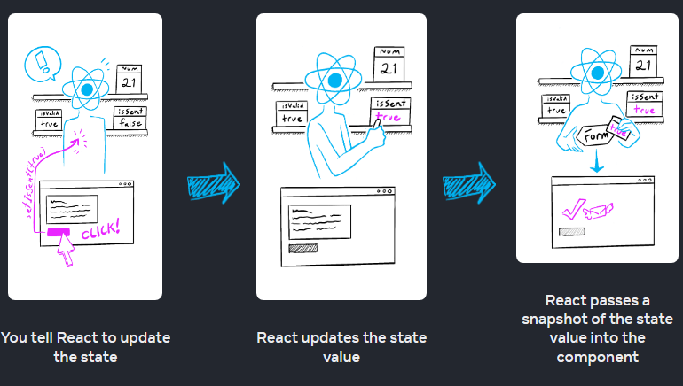

# ⭐ 6 State and Lifecycle

Trong Session này chúng ta tìm hiểu:

===============================

✅ State là gì ?

✅ Khái niệm One-Way / Two-way binding

✅ State và Lifecycle

✅ Cách Update một State

===============================

## 🔥 6.1 State ?

State giống như một kho lưu trữ dữ liệu cho các component trong ReactJS. Nó chủ yếu được sử dụng để cập nhật các trạng thái của một component khi người dùng thực hiện một số hành động như nhấp vào nút, nhập một số văn bản, nhấn một số phím, v.v.

===============================

### 🌻Tại sao lại cần đến State ?

Cùng xem một ví dụ minh họa để thấy sự cần thiết State.

2.Examples\myapp-ts\src\SessionsExamples\session-03-State\NeedState\GalleryNoState.js

2.Examples\myapp-ts\src\SessionsExamples\session-03-State\NeedState\GalleryState.js

### 🌻Khởi tạo một State

Example

```js

export default function Count() {
    // Tạo một State count, sử dụng hook useState
    const [count, setCount] = React.useState(0);
    const increase()=> {
        setCount(count + 1);
    }
    return (
        <h1>{count}</h1>
        <button onClick={increase()}>
        Increase 
      </button>
    )
}

```

===============================

## 🔥 6.2 One-Way / Two-way binding

Trong React nó có 2 chiều,

1: là chiều tương tác từ giao diện người dùng.

2: là chiều thay đổi dữ liệu (State) từ trong component

**🌻One-Way binding là gì ?**

Nếu 1 trong 2 chiều trên thay đổi, mà chiều cọn lại không thay đổi thì gọi là dữ liệu 1 chiều - One-Way binding

**🌻Two-way binding là gì ?**

Ngược lại nếu thay đổi 1 trong 2 chiều mà chiều còn lại cũng thay đổi theo thì gọi là Two-Way binding

Ví dụ: 2.Examples\myapp-js\src\SessionExamples\session-03-State\UpdateState

===============================

## 🔥 6.3 State and Lifecycle

> Render and Commit

Trước khi component hiển thị ra màn hình, chúng phải được render bới React. Bạn cần nắm các bước trong quá trình xử lý để giúp bạn hiểu được làm thế nào để code chạy và giải thích các hành vi của nó.


🌻 **Re-Render trong React là gì?**

Khi nói về Performances của React, có 2 giai đoạn chính mà chúng ta cần quan tâm:

- **initial render** : Khởi chạy App, React gọi Root Component bằng cách gọi `createRoot` tạo DOM và chạy hàm `render` để render component hiển thị ra màn hình.

- **Re-render** Xảy ra khi React cần update App một số giá trị mới. Thông thường, điều này xảy ra do người dùng tương tác với ứng dụng hoặc một số dữ liệu bên ngoài đến thông qua một yêu cầu bất đồng bộ hoặc một số mô hình đăng ký.

===============================

🌻 **Khi nào và tại sao một component render ?**

Có 2 lí do để 1 component render:

1. Render lần đầu tiên (initial render)

2. State của component hoặc component CHA của nó thay đổi.

===============================

🌻 **Các bước liên quan đến việc hiển thị một thành phần trên màn hình**

Quá trình xử lý yêu cầu tương tác từ giao diện người dùng có 3 bước:

1. Triggering a render (nhận yêu cầu Order từ khách đưa cho nhà bếp)

2. Rendering the component (nhà bếp chuẩn bị Order)

3. Committing to the DOM (Mang món ra bàn cho khách)



Chu trình này trong React Component còn được hiểu với một khái niệm đó là **LifeCycle** - Vòng đời của một Component.

- Component được sinh ra (**Mounting**)
- Component tồn tại và thay đổi (**Updation**)
- Component mất đi (**Unmounting**)

***

Xem thêm mô hình LifeCycle đối với Class Components: <https://projects.wojtekmaj.pl/react-lifecycle-methods-diagram/>

Xem ví dụ minh họa

Chúng ta sẽ tìm hiểu kỹ hơn các khái niệm này trong bài học về Hook useEffect. Trecking một component để biết khi nào thì nó **Mounting**, khi nào thi nó **Updation**, và khi nào thì nó đã **Unmounting**


Đọc thêm bài viết: <https://viblo.asia/p/lifecycle-component-trong-reactjs-gGJ59jzxKX2>

===========================

🔸**Step 1: Kích hoạt render**

- Initial render

Khởi chạy App, React gọi Root Component bằng cách gọi createRoot tạo DOM và chạy hàm render để render component hiển thị ra màn hình.

Example:

```js
import Image from './Image.js';
import { createRoot } from 'react-dom/client';

const root = createRoot(document.getElementById('root'))
root.render(<Image />);
```

- State update

Một component đã được render trước đó (Initial render), bạn có thể kích hoạt lại quá trình render bằng cách thay đổi State thông qua phương thức `set`

(Bạn có thể tưởng tượng những điều này giống như một vị khách của nhà hàng gọi trà, món tráng miệng và đủ thứ sau khi gọi món đầu tiên, tùy thuộc vào tình trạng khát hay đói của họ.)


🔸**Step 2: React render component của bạn**

Sau khi kích hoạt một render, React gọi đến component lấy nội dung hiển thị ra màn hình. **"Rendering"** nghĩa là React đang gọi đến component của bạn.

- Trong lần render đầu tiên (initial render): 

    + React sẽ gọi root component
    + React sẽ tạo các DOM Node

- Các lần render tiếp theo: 

  + React gọi đến function component có State thay đổi đã kích hoạt render. 
  + React sẽ tính toán so sánh các thuộc tính của chúng (state), nếu không có bất kỳ thay đổi nào kể từ lần render trước đó thì React bỏ qua và đến giai đoạn tiếp theo Commit.

🔸Step 3: React cập nhật thay đổi đến DOM

- Trong lần render đầu tiên (initial render): React sử dụng phương thức `appendChild()` DOM API để đặt tất cả các DOM nodes mà nó đã tạo vào `<div id="root">` để hiển thị ra màn hình.
    
- Re-renders: 
  - React tạo ra virtual DOM. React sẽ sử dụng thuật toán **Diffing** để nhận biết được đã có điều gì khác hoặc thay đổi trong virtual DOM.
  - Bước tiếp theo là Reconciliation. Ở bước này, virtual DOM sẽ được cập nhật lại với kết quả khác sau khi sử dụng thuật toán Diffing ở bước đầu tiên.
  - React chỉ update lại những gì thay đổi vào "real" DOM (DOM thật).

🔸Step 4 Kết: Vẽ lại trình duyệt

Sau khi rendering xong and React updated lại DOM, trình duyệt vẽ lại màn hình. 

===============================

**Ví dụ chứng minh React chỉ update lại những thay đổi cần thiết**

```js
//App.js
 
 function App() {
 
  console.log("Parent rendered");
  return (
    <div className="wrap">
        <h1>Parent Component</h1>
        <div>-----------------</div>
        <Child />
    </div>
  );
}

// Chỉ có biến count thay đổi ở Child
// Check console để xem
function Child(props){
   const [Count,setCount]=useState(0);
    console.log("Child Rendered");
    return(
        <div>
            <h1>Child Component</h1>
            <button onClick={()=>setCount(Count+1)}>
            Increase
            </button>
            <p>Count:{Count}</p>
    </div>
    );
}
 
export default App;

```

>`Xem thêm: Khi nào thì React component re-renders lại chính nó ?`

> View: <https://www.developerway.com/posts/react-re-renders-guide>

===============================

**Tại sao cần phải nắm chắc khi nào thì một Component Re-render?**

- Để ngăn Component re-render khi không cần thiết
- Tối ưu performance, app chạy nhanh hơn.


===============================

## 🔥 6.3 State là một Snapshot

Giống như mỗi giây thời gian trôi qua, bạn không thể lấy lại được. State cũng vậy, mỗi lần Component render thì nó tạo ra một giá trị tham chiếu mới hay còn gọi là Snapshot (một ảnh chụp) tại thời điểm đó.

### 🌻 6.3.1 Thay đổi State kích hoạt Render

Xem ví dụ: <https://beta.reactjs.org/learn/state-as-a-snapshot#setting-state-triggers-renders>


Điều gì xảy ra khi bạn click vào button Send:

- Form sẽ submit thông qua sự kiện onSubmit.
- setIsSent(true) set lại isSent =  true và tại hàng đợi để re-render mới.
- React sẽ re-renders lại component theo giá trị isSent mới.

### 🌻 6.3.1 Rendering takes a snapshot in time

“Rendering” nghĩa là React đang gọi component của bạn, sử dụng function component. JSX trả lại từ function như là một bản chụp  **snapshot** của UI tại thời điểm đó. Bao gồm: các props, event handlers, local variables, tất cả các calculated sử dụng state tại thời điểm render.

Khi React re-renders lai một component:

- React gọi đến component function một lần nữa.
- function trả lại một JSX snapshot mới.
- React sau đó update màn hình để khớp với snapshot mà bạn trả lại.



Chi tiết hơn



Ví dụ để hiểu Snapshot State

<https://beta.reactjs.org/learn/state-as-a-snapshot#rendering-takes-a-snapshot-in-time>

<https://beta.reactjs.org/learn/state-as-a-snapshot#state-over-time>


===============================

## 🔥 6.4 State Updates

### 🌻 6.4.1 Khái niệm `queue` = hàng đợi

- Details: <https://beta.reactjs.org/learn/queueing-a-series-of-state-updates>
- Làm rõ vấn đề cách update State

```js
// 4 cách set giá trị mới cho một State
setNumber(number + 5);
setNumber(prev => prev + 1);
setNumber(42);

setEnabled(e => !e);

```

### 🌻 6.4.2 State là một Object

```js
//App.js
import { useState } from 'react';

export default function Form() {
  const [person, setPerson] = useState({
    firstName: 'Barbara',
    lastName: 'Hepworth',
    email: 'bhepworth@sculpture.com'
  });

  //Method 1:
  setPerson({
    firstName: 'Alexander', 
    lastName: 'Brahma',
    email: 'alexander@gmail.com'
    });
  //Method 2: ... object spread syntax 
  setPerson({
    ...person, // Copy the old fields
    firstName: 'Alexander' // But override this one
    });
}
```

View details: <https://beta.reactjs.org/learn/updating-objects-in-state>

===============================

### 🌻 6.4.3 State là một Mảng

>`Updating arrays without mutation`

Dưới đây là một bảng so sánh phương thức mảng. Khi bạn thao tác với mảng trong React State, bạn cần tránh sử dụng các phương thức bên cột trái, nên sử dụng phương thức bên cột phải để thay thế.

|              |      avoid (mutates the array)        | prefer (returns a new array)     |
| :------------:|:-------------:|:-----:|
|  **adding**   |   `push`, `unshift`   |  concat, [...arr] spread syntax    |
|  **removing** |   `pop`, `shift`, `splice`   |   `filter`, `slice`   |
|  **replacing**   | `splice`, `arr[i] = ... assignment` |  `map`  |
|  **sorting**  | `reverse`, `sort`  |  copy the array first  |


- Thêm phần tử vào mảng:

View details: <https://beta.reactjs.org/learn/updating-arrays-in-state#adding-to-an-array>

- Xóa phần tử của mảng:

Xem: <https://beta.reactjs.org/learn/updating-arrays-in-state#removing-from-an-array>

- Biến đổi phần tử mảng: 

<https://beta.reactjs.org/learn/updating-arrays-in-state#transforming-an-array>

- Thay thế phần tử mảng:

<https://beta.reactjs.org/learn/updating-arrays-in-state#replacing-items-in-an-array>

- Chèn một phần tử vào mảng:

<https://beta.reactjs.org/learn/updating-arrays-in-state#inserting-into-an-array>

- Thay đổi một Object trong một mảng

<https://beta.reactjs.org/learn/updating-arrays-in-state#updating-objects-inside-arrays>


===============================

## 🔥 6.5 Managing State (Advanced)

View details: <https://beta.reactjs.org/learn/managing-state>
