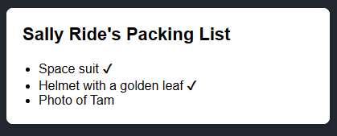

# ⭐ Session 4 - Handling events and Conditional Rendering

>**Bạn sẽ nắm được**
>
>- Các cách khác nhau để tạo ra một event handler
>- Làm thế nào để truyền event handling logic từ một  component CHA
>
>- Thế nào là một sự kiện lan truyền và cách khắc phục

## 🔥 Responding to Events (Phản hồi sự kiện)

Khi bạn click chuột, rê chuột, focus vào một input... thì đó là những sự kiện. React cho phép bạn tạo ra các phản hồi lại giao diện người dùng tương ứng với từng sự kiện.

Doc: <https://beta.reactjs.org/learn/responding-to-events>

Handling events trong React elements rất giống với handling events trong DOM elements (DOM thật), chỉ khác cú pháp.

- React events có tên đặt theo kiểu camelCase.
- Với JSX bạn truyền một function như là một event handler, hơn là chuỗi.

DOM Events Javascript: <https://www.w3schools.com/jsref/dom_obj_event.asp>

🌻 Ví dụ một sự kiện click trong HTML:

```js
<button onclick="activateLasers()">
  Activate Lasers
</button>
```

## 🔥Tạo một event handlers

🌻 in React

```js
function handleClick() {
    alert('You clicked me!');
}
<button onClick={handleClick}>
  Click me
</button>

//inline

<button onClick={(e: React.MouseEvent<HTMLButtonElement, MouseEvent>) => {
   e.preventDefault();
  console.log('You clicked me!');
}}> Click Me</button>

```

🌻 Form Submit

```js
export default function Signup() {
  return (
    <form onSubmit={(e: React.FormEvent<HTMLFormElement>) => {
      e.preventDefault();
      alert('Submitting!');
    }}>
      <input />
      <button>Send</button>
    </form>
  );
}
```

Lưu ý: Để truyền một Event handlers thì ta truyền chứ không được GỌI. Ví dụ:

| passing a function (correct)   | calling a function (incorrect)   |
|--------------------------------|----------------------------------|
| `<button onClick={handleClick}>` | `<button onClick={handleClick()}>` |

## 🔥 Event Handlers có sử dụng tham số

```html
<button onClick={() => alert(message)}>Delete Row</button>
```

## Truyền Event Handlers như là Props

`onClick ` function event handler dùng như một props, được lấy từ props

Dùng cách này thì tên của nó bắt buộc bắt đầu bằng `on`

```js
type ButtonTypeProps = {
  onClick: () => void;
  children?: React.ReactNode;
}

function Button({ onClick, children } : ButtonTypeProps) {
    return (
      <button onClick={onClick}>
        {children}
      </button>
    );
  }
  

type PlayButtonProp = {
  movieName: string
}


function PlayButton({ movieName } : PlayButtonProp) {
    //function event handler
    function handlePlayClick() {
      alert(`Playing ${movieName}!`);
    }
  
    return (
      <Button onClick={handlePlayClick}>
        Play "{movieName}"
      </Button>
    );
  }
  
  function UploadButton() {
    return (
      <Button onClick={() => alert('Uploading!')}>
        Upload Image
      </Button>
    );
  }
  
  export default function Toolbar() {
    return (
      <div>
        <PlayButton movieName="Kiki's Delivery Service" />
        <UploadButton />
      </div>
    );
  }

```

## Event propagation

Có hai cách để sự kiện được lan truyền (event propagation) trong HTML DOM: `bubbling` và `capturing`.

Khái niệm **Event propagation** là cách định nghĩa thứ tự của HTML element khi event xảy ra.

Ví dụ nếu ta có một phần tử `<p>` bên trong một phần tử `<div>`.

```html
<!-- Trong Html -->
<div onclick="suKienA">
    <p onclick="suKienB"></p>
</div>
```

Nếu Khi người dùng click lên phần tử `<p>`, thì sự kiện “click” của phần tử nào sẽ được xử lý trước?


Trong bubbling, sự kiện của phần tử bên trong cùng sẽ được xử lý trước:

- Với ví dụ trên, sự kiện “click” của phần tử `<p>` sẽ được xử lý trước
- Sau đó đến sự kiện của phần tử `<div>`.

Trong capturing thì ngược lại, sự kiện của phần tử bên ngoài cùng sẽ được xử lý trước:

- Sự kiện “click” của phần tử `<div>`được xử lý trước
- Sau đó tới phần tử `<p>`.

Ví dụ trong React: <https://beta.reactjs.org/learn/responding-to-events#event-propagation>

## Stopping propagation

Xem: <https://beta.reactjs.org/learn/responding-to-events#stopping-propagation>

Hoặc ví dụ với Typescript trong Folder ví dụ

## Preventing default behavior

Xem: <https://beta.reactjs.org/learn/responding-to-events#preventing-default-behavior>

```js
<button onClick={(e: React.MouseEvent<HTMLButtonElement, MouseEvent>) => {
   e.preventDefault();
  console.log('You clicked me!');
}}> Click Me</button>

```

Với một function handler

```js

const handlerClick = (e: React.MouseEvent<HTMLButtonElement, MouseEvent>) => {
    e.preventDefault();
    alert('Clicked!');
  }

<button onClick={(e: React.MouseEvent<HTMLButtonElement, MouseEvent>) => handlerClick(e)}>
 Click Me
 </button>

```


Nội dung liên quan: hook useRef, làm MusicPlayler

==========================

## 🔥 Conditional Rendering

Component của bạn sẽ thường xuyên cần hiển thị khác nhau tương ứng với các điều kiện khác nhau. Trong React, Bạn có thể render JSX có điều kiện bằng cách sử dụng cú pháp JavaScript như **`if`** statements, `&&`, và  `? : ` toán tử 3 ngôi.


> **Trong Session này bạn sẽ nắm được**
> - Làm thể nào để trả về một JSX phụ thuộc vào một điều kiện
> - Điều kiện bao gồm include hoặc loại trừ exclude một phần của JSX.
> - Cú pháp shorthand ràng buộc điều kiện bạn thường thấy trong React
>


Ví dụ minh họa



Tạo một component để thực hiện ví dụ trên.

## 🔥 Điều kiện trả về biểu thức `JSX`

```js
//App.js

function Item({ name, isPacked } : {name: string, isPacked: boolean}) {
  if (isPacked) {
    //returning JSX
    return <li className="item">{name} ✔</li>;
  }
  //returning JSX
  return <li className="item">{name}</li>;
}

export default function PackingList() {
  return (
    <section>
      <h1>Sally Ride's Packing List</h1>
      <ul>
        <Item 
          isPacked={true} 
          name="Space suit" 
        />
        <Item 
          isPacked={true} 
          name="Helmet with a golden leaf" 
        />
        <Item 
          isPacked={false} 
          name="Photo of Tam" 
        />
      </ul>
    </section>
  );
}


```

## 🔥 Điều kiện trả về không có gì với `null`

```js
function Item({ name, isPacked } : {name: string, isPacked: boolean}) {
   // If isPacked is true, the component will return nothing, null
  if (isPacked) {
    return null;
  }
  return <li className="item">{name}</li>;
}
....

```

## 🔥 Điều kiện toán tử ngôi thứ 3 (? :)

```js
 ...

function Item({ name, isPacked } : {name: string, isPacked: boolean}) {
  return (
    <li className="item">
      {isPacked ? name + ' ✔' : name}
    </li>
  );
}
...
```

## 🔥 Logical AND operator (&&)

```js
...

function Item({ name, isPacked } : {name: string, isPacked: boolean}) {
  return (
    <li className="item">
      {name} {isPacked && '✔'}
    </li>
  );
}
...

```

## 🔥 Điều kiện gán một JSX như là một biến

```js
function Item({ name, isPacked } : {name: string, isPacked: boolean}) {
  let itemContent = name;
  if (isPacked) {
    itemContent = name + " ✔";
  }
  return (
    <li className="item">
      {itemContent}
    </li>
  );
}

```